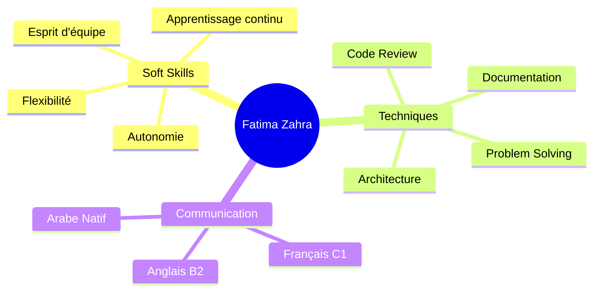

# 👋 Salut, moi c'est Fatima Zahra NAAMY

<div align="center">
  
### 💻 Développeuse Full Stack | Java • PHP • Laravel • JavaScript • Spring Boot

[](https://linkedin.com/in/FatimaZahraNAAMY)
[](mailto:naamyfatimazahra@gmail.com)
[](https://github.com/Fatima.Zahra.Naamy)
[](tel:+212624290648)

</div>

---

## 🚀 À propos de moi

Développeuse Full Stack passionnée par la création d'**applications performantes, évolutives et sécurisées**. Je me spécialise dans l'écosystème **Java/JEE** et **PHP/Laravel**, avec une expertise en développement web backend/frontend et une vision orientée **cloud** et **monitoring**.

Actuellement chez **Dashy** en tant que stagiaire, je travaille sur la supervision cloud avec **Azure Monitor** et **Grafana**, tout en développant mes compétences en infrastructure et méthodologies agiles.

```javascript
const fatimaZahra = {
    role: "Full Stack Developer",
    location: "Casablanca, Maroc 🇲🇦",
    education: "YouCode UM6P",
    languages: {
        native: "Arabe",
        professional: ["Français (C1)", "Anglais (B2)"]
    },
    expertise: {
        backend: ["Java", "Spring Boot", "PHP", "Laravel", "JPA/Hibernate"],
        frontend: ["JavaScript", "Angular", "TailwindCSS", "JSP"],
        cloud: ["Azure Monitor", "Grafana", "Docker"],
        databases: ["PostgreSQL", "MySQL"],
        architecture: ["MVC", "REST API", "Microservices"],
        tools: ["Git", "GitHub", "Jira", "Figma", "Swagger/OpenAPI"]
    },
    methodologies: ["Agile", "Scrum", "Kanban"],
    softSkills: ["Autonomie", "Esprit d'équipe", "Apprentissage continu", "Adaptabilité"],
    currentFocus: "Cloud Infrastructure & Monitoring Solutions"
};
```

---

## 🛠️ Stack Technique

<table>
<tr>
<td valign="top" width="50%">

### Frontend


**Compétences** : JSP, Ajax, interfaces responsives

</td>
<td valign="top" width="50%">

### Backend


**Frameworks** : Spring Boot, Spring Data JPA, Spring AOP, Spring MVC, Hibernate, JEE, Servlets

</td>
</tr>
<tr>
<td valign="top" width="50%">

### Cloud & DevOps


**Outils** : Azure Monitor, supervision infrastructure

</td>
<td valign="top" width="50%">

### Bases de données


**Compétences** : Conception de schémas relationnels, optimisation des requêtes

</td>
</tr>
</table>

### 📋 Méthodologies & Outils


---

## 💼 Expérience Professionnelle

### 🏢 Stagiaire Développement & Supervision Cloud
**Dashy** | Casablanca, Maroc | Mai 2025 - Présent

```yaml
Mission: Optimisation de la supervision infrastructure et développement de solutions cloud
```

**Réalisations clés** :
- 📊 **Tableaux de bord Grafana** : Configuration de dashboards personnalisés pour le monitoring temps réel de l'infrastructure
- ⚠️ **Alertes automatisées Azure** : Mise en place d'un système d'alertes proactif pour détecter les incidents avant impact utilisateur
- 🔍 **Analyse et optimisation logs** : Intégration de sources Azure Monitor et amélioration des métriques personnalisées
- 🔒 **Sécurité réseau** : Protection des données avec CSRF/XSS et chiffrement
- 🤝 **Méthodologie Agile** : Collaboration en Kanban avec l'équipe technique, revues de sprint hebdomadaires

**Stack technique** : `Grafana` `Azure Monitor` `Docker` `Git` `Méthodologie Agile (Kanban)`

---

## 🚀 Projets Réalisés

### 🚚 TrackItAll - Gestion de Supply Chain
> *Application MVC pour optimiser la chaîne d'approvisionnement de bout en bout*

[](https://github.com/username/trackitall)
[](https://github.com/username/trackitall)
[](https://github.com/username/trackitall)

**Contexte** : Solution enterprise pour centraliser la gestion des flux logistiques

**Modules développés** :
- 📦 **Approvisionnement** : Gestion des commandes fournisseurs et stock
- 🏭 **Production** : Suivi du cycle de fabrication avec rôles utilisateurs
- 🚛 **Livraison** : Tracking en temps réel des expéditions

**Architecture & Bonnes pratiques** :
- ✅ Architecture MVC avec Spring Boot (séparation Controller/Service/Repository)
- ✅ API REST sécurisée documentée avec **Swagger/OpenAPI**
- ✅ Persistence avec **JPA/Hibernate** et gestion transactionnelle
- ✅ Tests unitaires **JUnit** et tests d'intégration **Mockito** (couverture >80%)
- ✅ Gestion des erreurs avec exceptions personnalisées

**Stack technique** : `Java` `Spring Boot` `Spring Data JPA` `Hibernate` `MySQL` `Swagger` `JUnit` `Mockito`

🔗 **[Voir le projet sur GitHub](https://github.com/username/trackitall)**

---

### 📚 YouCourse - Plateforme E-learning
> *Solution complète de formation en ligne avec paiement intégré*

[](https://github.com/username/youcourse)
[](https://github.com/username/youcourse)
[](https://github.com/username/youcourse)

**Objectif** : Démocratiser l'accès à l'éducation en ligne avec une expérience utilisateur fluide

**Fonctionnalités principales** :
- 👤 **Système d'inscription** : Authentification sécurisée et gestion des profils
- 💳 **Paiement automatisé** : Intégration passerelle de paiement pour l'achat de cours
- 📊 **Tableau de bord apprenant** : Suivi personnalisé des progrès et certifications
- 📱 **Interface responsive** : Design moderne avec TailwindCSS, compatible tous devices

**Stack technique** : `HTML5` `TailwindCSS` `JavaScript` `PHP` `MySQL`

🔗 **[Voir le projet sur GitHub](https://github.com/username/youcourse)**

---

## 🎓 Formation

### 💻 Formation en Développement Web & Mobile
**YouCode UM6P** | 2024 - Actuellement

Programme intensif Full Stack couvrant : architecture logicielle, frameworks modernes, méthodologies agiles, DevOps

### 📜 Licence en Droit Arabe
**Université Ibn Zohr, Agadir** | 2019 - 2022

Compétences transversales : analyse critique, rigueur, communication

### 🎓 Baccalauréat Sciences Humaines
**Lycée Essafa, AGADIR** | 2019

---

## 🌱 Actuellement en apprentissage

- ☁️ **Architecture Cloud Native** avec Azure (AZ-900 en préparation)
- 📊 **Observabilité avancée** : Prometheus, ELK Stack, APM
- 🐳 **Orchestration conteneurs** : Kubernetes (K8s), CI/CD pipelines
- 🔐 **Sécurité applicative** : OWASP Top 10, authentification OAuth2/JWT
- 🚀 **Performance** : Optimisation requêtes SQL, caching Redis

---

## 📊 GitHub Stats

<div align="center">


</div>

---

## 💡 Compétences Transversales



---

## 📫 Contactez-moi

Je suis ouverte aux opportunités de **CDI**, **projets freelance**, et **collaborations techniques**. N'hésitez pas à me contacter !

<div align="center">

[](https://linkedin.com/in/FatimaZahraNAAMY)
[](mailto:naamyfatimazahra@gmail.com)
[](https://github.com/Fatima.Zahra.Naamy)
[](tel:+212624290648)

</div>

---

<div align="center">

### ⭐️ Si mes projets vous intéressent, n'hésitez pas à laisser une étoile sur GitHub !

**"Coder avec passion, construire avec détermination"** 💻✨


</div>

---

## 📝 Note

Ce README est régulièrement mis à jour avec mes derniers projets et compétences. Dernière mise à jour : Décembre 2024
